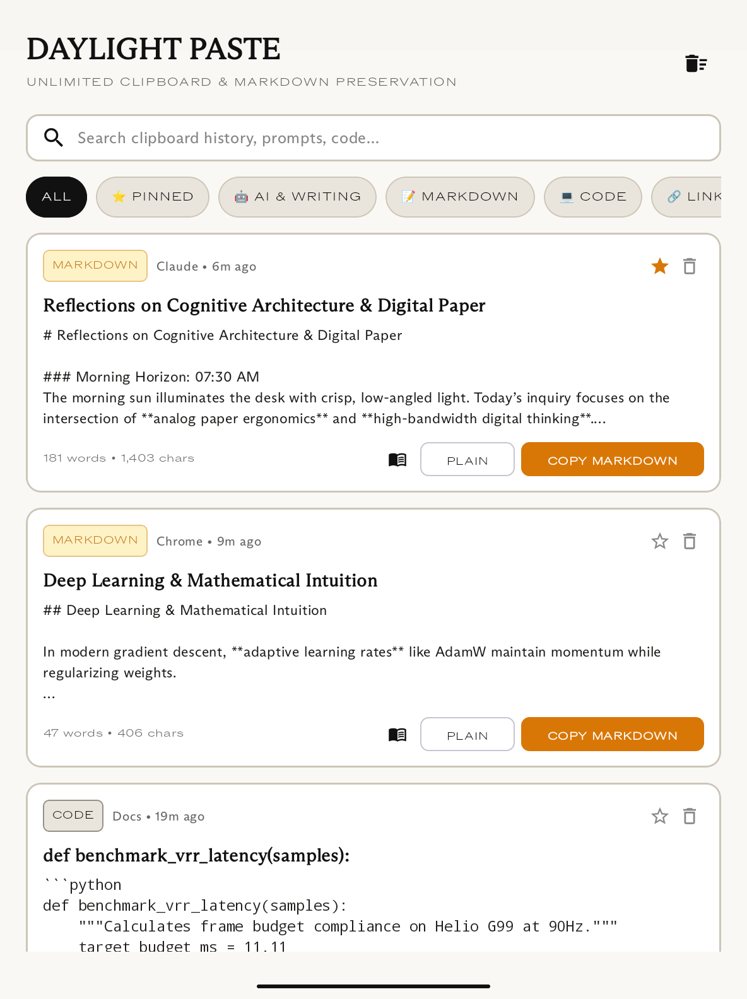
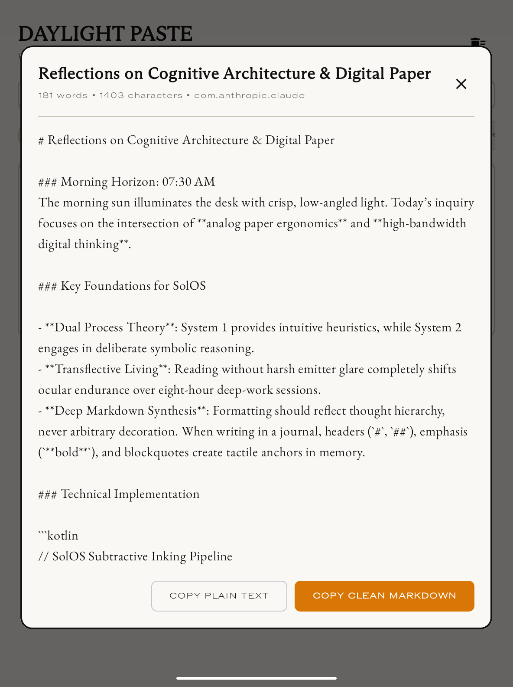
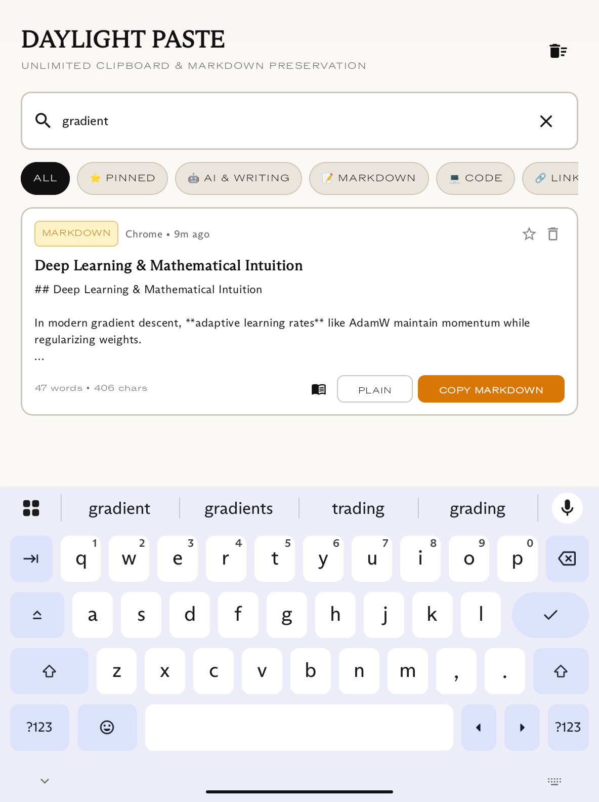
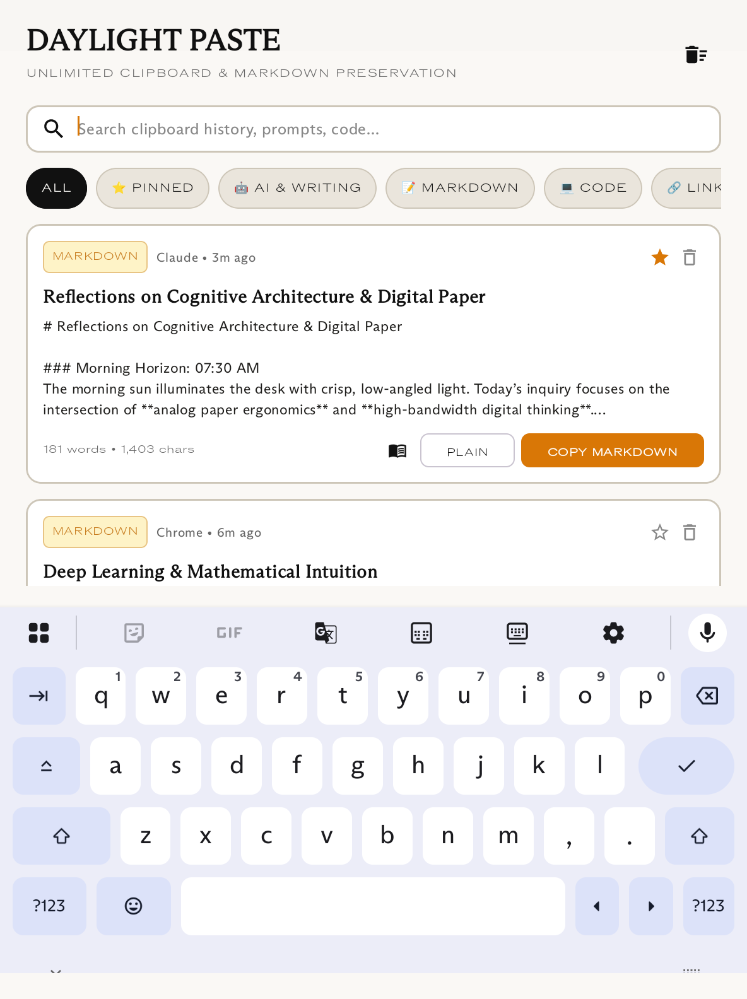
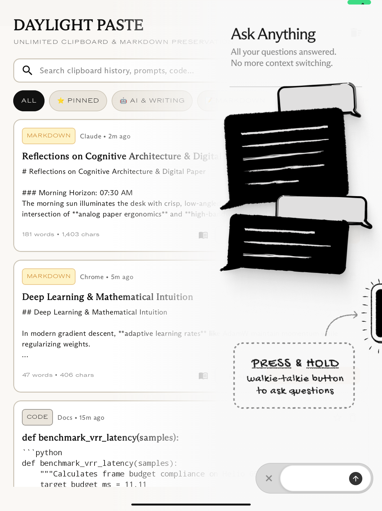
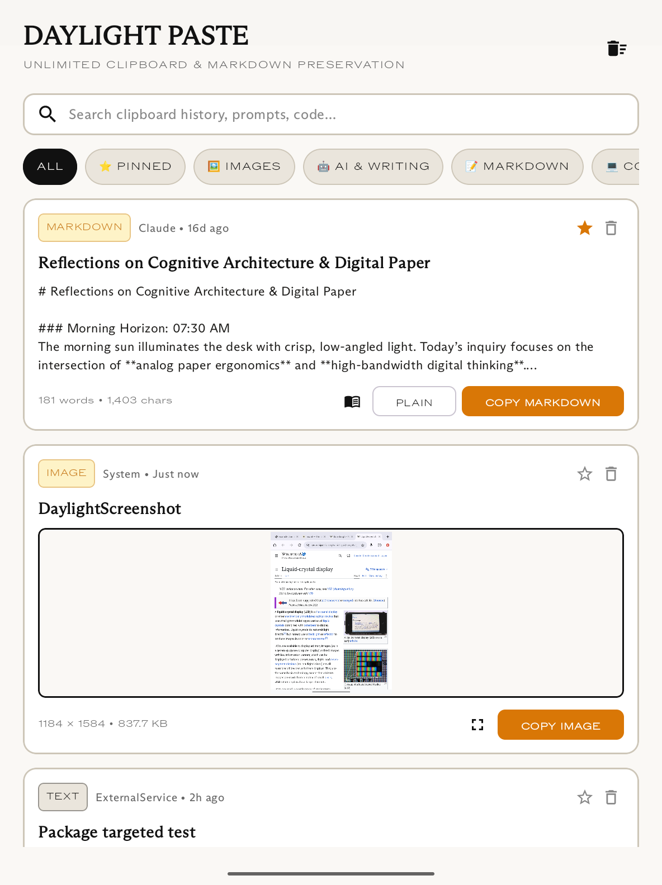
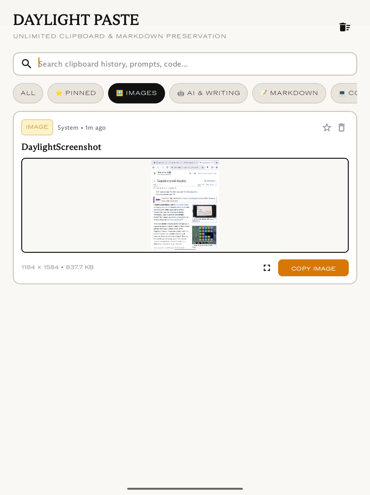
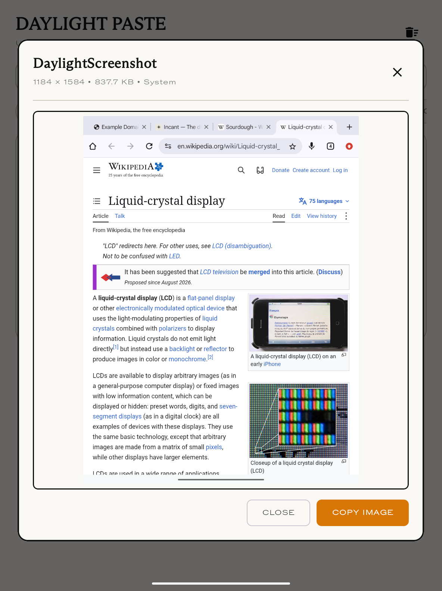
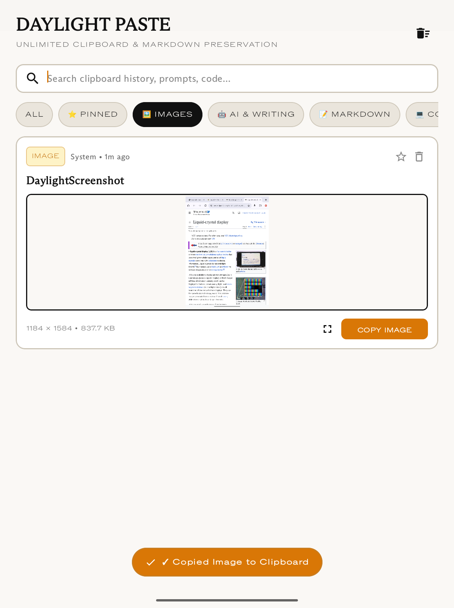

# Daylight Paste (SolOS / Daylight DC-1)

A ground-up implementation of a **Mac Paste-inspired unlimited digital stationery clipboard manager** engineered specifically for the **Daylight Computer (Daylight DC-1)** running SolOS (Android 13).

Optimized for the custom 10.5" 1200×1600 @ 200 DPI **LivePaper transflective reflective LCD**, pure DC analog constant-current dimming, and dynamic 45Hz–90Hz VRR.

---

## The Two Core Problems Solved

### 1. Unlimited Clipboard Size (No Binder IPC Truncation)
- **The Android Issue**: Android apps communicate with `system_server`'s `ClipboardService` through the Linux kernel Binder driver (`/dev/binder`), which enforces a fixed **1MB shared memory buffer pool per process**. Copying large AI generations (essays, book chapters, long source code) crashes with `android.os.TransactionTooLargeException` or is aggressively truncated. Keyboards (Gboard / Samsung Keyboard) cap history to 10,000–25,000 characters.
- **The Daylight Paste Solution**: All clipboard captures are indexed in a local SQLite Write-Ahead Logging (WAL) database capable of storing 100,000+ character documents with zero truncation. When copying out to the system clipboard, `DaylightPasteManager` applies safe chunking to guarantee transactions stay within Binder limits while delivering full documents.

### 2. Preserving Markdown Formatting for Day One & Note Apps
- **The Android Issue**: iOS AI apps place raw Markdown directly into `public.utf8-plain-text`, allowing Day One on iOS to render full Markdown syntax. Android AI apps place rich text into `text/html` and plain text into `text/plain` via DOM `innerText`, which completely strips `#` headings, `**bold**`, `*italics*`, lists, and code backticks. Day One on Android reads `text/plain` and receives unstyled flat text.
- **The Daylight Paste Solution**: Built-in `MarkdownTranspiler` intercepts clipboard updates in real time, converts HTML fragments into clean GitHub Flavored Markdown / CommonMark syntax, and injects clean Markdown directly into `text/plain` upon copy. Day One and note apps receive 100% intact Markdown formatting.

### 3. Image Clipboard History (Streaming ContentProvider)
- **The Android Issue**: Copying large uncompressed bitmaps directly trips the 1MB Binder transaction limit immediately, while temporary content URIs from other apps expire or fail with `SecurityException` when shared with note-taking apps.
- **The Daylight Paste Solution**: `ClipboardWatcherService` captures image streams (`image/png`, `image/jpeg`, `image/webp`) into private app storage (`clips/images/`). Images are served through an exported streaming `DaylightPasteContentProvider` returning `ParcelFileDescriptor.open(file, MODE_READ_ONLY)`. Other apps stream image data directly through Linux kernel pipes with zero Binder memory footprint.

---

## Features

### 1. Tactile Stationery Pinboard Cards
- Clippings are rendered as physical stationery cards on LivePaper canvas (`#FAF8F5`) with ink black (`#111111`) and cream surfaces (`#EAE5DC`).
- Content-type badges: `MARKDOWN`, `PLAIN`, `CODE`, `LINK`, `AI & WRITING`, `IMAGE`.
- Metadata at a glance: character count, word count, image dimensions & file size, relative timestamp, and source application package.

### 2. Image Clipping Support
- High-contrast visual thumbnails on `#FAF8F5` paper canvas with `#111111` 1.5dp borders.
- Dedicated `🖼️ IMAGES` pinboard tab for browsing screenshots and copied artwork.
- One-tap `COPY IMAGE` button placing streaming `content://` URIs with URI read permissions onto the system clipboard.
- Full-screen distraction-free `ImagePreviewDialog` modal for inspecting high-res diagrams and screenshots.

### 3. Instant Sub-Millisecond Search
- Real-time full-text search across all stored clipping content, titles, URLs, and source packages with zero typing latency.

### 4. Smart Pinboard Categories
- Organized into dedicated filters:
  - `ALL`: Complete clipboard history.
  - `⭐ PINNED`: Pinned essential snippets that never get pruned.
  - `🖼️ IMAGES`: Image clippings, screenshots, and diagrams.
  - `🤖 AI & WRITING`: AI prompts, LLM generations, essays, and journals.
  - `📝 MARKDOWN`: Documents containing formatted Markdown syntax.
  - `💻 CODE`: Source code snippets rendered in `Iosevka` monospace.
  - `🔗 LINKS`: Extracted web URLs.

### 5. Multi-Action Formatting
- **"COPY MARKDOWN"**: Formats and places clean Markdown into clipboard for Day One, Obsidian, Logseq, and Notion.
- **"PLAIN"**: Strips formatting for clean terminal, code editor, or raw text entry.
- **"COPY IMAGE"**: Streams full-resolution images to drawing and journal apps without Binder limits.

### 6. Distraction-Free Long-Form Reader Modal
- Tapping the reader icon on any text card opens the entire text in a full-screen book layout typeset in `EB Garamond`.

---

## Visual Tour & App States

| State | Preview | Description |
|---|---|---|
| **1. Main Pinboard Cards** |  | **Tactile Stationery Interface**: LivePaper cards with character & word counts, source application, category badges (`MARKDOWN`, `AI & WRITING`, `CODE`), and dual copy actions (`COPY MARKDOWN` / `PLAIN`). |
| **2. Long-Form Reader Modal** |  | **Distraction-Free Reading**: Full-screen reader rendered in literary `EB Garamond` typography. Designed specifically for comfortable reading of massive AI outputs on the LivePaper transflective display. |
| **3. Instant Search Filtering** |  | **Sub-Millisecond Search**: Real-time full-text search filtering across history (e.g. searching "gradient" isolates matching code and journal entries instantly). Includes quick-clear action. |
| **4. Smart Pinboard Categories** |  | **Category Organization**: Filtering by content type. The `💻 CODE` filter displays snippets formatted in `Iosevka` monospace with indentation preservation. |
| **5. Tactile Amber Confirmation** |  | **Visual Feedback**: Ambient 595nm amber confirmation pill (`✓ Copied Clean Markdown to Clipboard`) verifying safe injection of Markdown into the Android clipboard. |
| **6. Image Clip Cards** |  | **Visual Image Cards**: High-contrast thumbnails on `#FAF8F5` paper canvas with `#111111` 1.5dp borders, dimensions & file size badges, and solid amber `COPY IMAGE` action. |
| **7. Images Pinboard Filter** |  | **Dedicated Images Tab**: `🖼️ IMAGES` filter isolating screenshots and imported images for fast browsing on the LivePaper display. |
| **8. Fullscreen Image Preview** |  | **Full-Screen LivePaper Modal**: Full-fidelity image modal with `#FAF8F5` surface, 2dp border, image dimensions, and quick copy action. |
| **9. Image Copied Toast** |  | **Tactile Feedback**: 595nm amber pill confirmation (`✓ Copied Image to Clipboard`) when streaming content URI is placed onto clipboard. |

---

## Architecture & Hardware Compatibility

- **Display Panel**: Custom 10.5" 1200×1600 @ 200 DPI transflective reflective LCD. (Never referred to as Memory-in-Pixel/MIP).
- **Backlight Drive**: Pure analog constant-current DC dimming with zero PWM strobing.
- **Refresh Rate**: Dynamic 45Hz–90Hz VRR with canonical baseline locked ceiling at 90Hz (`persist.daylight.refreshrate=90`).
- **Typography Tokens**:
  - Headings: `ABC Arizona Mix`
  - Labels & Tracking: `ABC ROM Extended Light`
  - Body & UI: `ABC Arizona Sans`
  - Long-Form Reader: `EB Garamond`
  - Code Blocks: `Iosevka`
- **Color Tokens**: Pure Ink Black (`#111111`), Paper Canvas (`#FAF8F5`), Cream Surface (`#EAE5DC`), Amber Accent (`#D97706`).

---

## Project Structure

```
DaylightPaste/
├── app/
│   ├── build.gradle.kts
│   └── src/
│       ├── main/
│       │   ├── AndroidManifest.xml
│       │   ├── java/com/daylightcomputer/paste/
│       │   │   ├── DaylightPasteApp.kt
│       │   │   ├── data/
│       │   │   │   ├── ClipDatabase.kt
│       │   │   │   ├── ClipStreamProvider.kt
│       │   │   │   ├── DaylightClip.kt
│       │   │   │   └── DaylightPasteContentProvider.kt
│       │   │   ├── markdown/
│       │   │   │   └── MarkdownTranspiler.kt
│       │   │   ├── service/
│       │   │   │   ├── BootReceiver.kt
│       │   │   │   ├── ClipImportReceiver.kt
│       │   │   │   ├── ClipboardWatcherService.kt
│       │   │   │   ├── DaylightPasteManager.kt
│       │   │   │   └── OverlayPasteService.kt
│       │   │   ├── ui/
│       │   │   │   ├── MainActivity.kt
│       │   │   │   ├── PasteScreen.kt
│       │   │   │   ├── ProcessCopyActivity.kt
│       │   │   │   ├── ProcessPasteActivity.kt
│       │   │   │   ├── components/
│       │   │   │   │   ├── ClipCard.kt
│       │   │   │   │   ├── ImagePreviewDialog.kt
│       │   │   │   │   ├── PinboardTabs.kt
│       │   │   │   │   ├── ReaderDialog.kt
│       │   │   │   │   └── SearchBar.kt
│       │   │   │   └── theme/
│       │   │   │       ├── DaylightColor.kt
│       │   │   │       └── DaylightTypography.kt
│       │   └── res/
│       │       ├── font/
│       │       │   ├── abc_arizona_flare_variable.ttf
│       │       │   ├── abc_arizona_mix_variable.ttf
│       │       │   ├── abc_arizona_sans_variable.ttf
│       │       │   ├── abc_rom_extended_light.otf
│       │       │   └── eb_garamond_regular.ttf
│       │       ├── mipmap-*/
│       │       └── values/
│       └── test/
│           └── java/com/daylightcomputer/paste/
│               ├── ImageClipboardTest.kt
│               ├── MarkdownTranspilerTest.kt
│               └── UnlimitedSizeTest.kt
├── build.gradle.kts
├── gradle.properties
├── settings.gradle.kts
└── README.md
```

---

## Building & Installing

### Prerequisites
- JDK 17+
- Android SDK (API 34 compileSdk, API 33 targetSdk, API 26 minSdk)

### Build APK
```bash
./gradlew assembleDebug
```

### Run Unit Tests
```bash
./gradlew testDebugUnitTest
```

### Install to Daylight DC-1
```bash
adb install -r -d -g app/build/outputs/apk/debug/app-debug.apk
```

### Start App / Service
```bash
# Launch UI
adb shell am start -n com.daylightcomputer.paste/.ui.MainActivity

# Start Clipboard Watcher Service
adb shell am start-foreground-service com.daylightcomputer.paste/.service.ClipboardWatcherService
```

### Seed Test Data
```bash
adb shell am broadcast -a com.daylightcomputer.paste.ACTION_INSERT_CLIP \
  --es title "Test Clip" \
  --es text "Hello world from Daylight Paste" \
  --es type "MARKDOWN"
```
