# Master Architecture & Peer-Review Prompt: Daylight Paste for SolOS (Daylight DC-1)

> **Instructions for the Reviewer**: You are an expert Android Systems Architect, OS Engineer, and AI Systems Designer. You are conducting an adversarial code and architectural review of **Daylight Paste**, a custom system clipboard suite built for the **Daylight Computer (Daylight DC-1)** running **SolOS (Android 13)**. Read the complete project context, technical architecture, empirical findings, and roadmap below, and provide high-impact architectural feedback, potential failure modes, and concrete engineering proposals.

---

## 1. Project Overview & Repository
- **Project Name**: Daylight Paste (`com.daylightcomputer.paste`)
- **Target Device**: Daylight Computer DC-1 (10.5" LivePaper transflective reflective LCD, MediaTek Helio G99, Android 13 / SolOS)
- **Private GitHub Repository**: `https://github.com/a12k-a2b/daylight-paste` (Branch: `main`)
- **Primary Purpose**: Eradicate Android's clipboard character truncation and Markdown formatting loss, bringing iOS-grade infinite-length rich clipboard handling to SolOS with a macOS **Paste** (pasteapp.io) tactile stationery interface, complete image clipboard history with streaming ContentProviders (Pass 2), followed by fast semantic AI search (Pass 3).

---

## 2. The Core Problem Statement & User Intent

### Problem A: Why Stock Android Truncates Huge Text Halfway
1. **The 1MB Binder IPC Ceiling**:
   - In Android, all clipboard communication between client apps and `system_server` (`ClipboardService`) travels through the Linux kernel Binder driver (`/dev/binder`).
   - The kernel allocates a fixed **1MB shared memory buffer pool per process** for all concurrent inbound transactions.
   - When copying massive AI generations (essays, book chapters, long codebases), passing payloads over ~800KB–1MB immediately crashes with:
     ```text
     android.os.TransactionTooLargeException: data parcel size 1500232 bytes
     ```
   - To avoid outright crashes, many Android apps catch this exception and arbitrarily truncate text payloads.
2. **Keyboard Clipboard Drawer Truncation (Gboard & Samsung Keyboard)**:
   - AOSP has historically delegated multi-item clipboard history to keyboards (like Gboard).
   - Because keyboards insert text into applications using `InputConnection.commitText()` (another Binder IPC transaction), **Gboard enforces an aggressive hard cap of 10,000–25,000 characters per clipboard item**.
   - Copying a 50,000-word generation out of Gboard's clipboard drawer silently cuts it in half.
3. **How iOS / iPadOS Solves This**:
   - iOS's `UIPasteboard` is backed by the `pboard` daemon. Small items pass via Mach messages, but any payload exceeding a small threshold is written directly to **shared memory (`mmap`) or temporary file-backed storage**.
   - iOS has no 1MB IPC bottleneck, allowing multi-megabyte text payloads to transfer frictionlessly.

### Problem B: Why Markdown Formatting is Lost When Pasting on Android
1. **UTIs vs. MIME Types**:
   - **iOS**: Uses Apple Uniform Type Identifiers (`public.utf8-plain-text`, `net.daringfireball.markdown`, `public.html`). Major AI apps (ChatGPT, Claude, Perplexity) on iOS write the **raw Markdown string directly into `public.utf8-plain-text`** because Markdown is standard plain text.
   - **Android**: Uses MIME types (`text/plain`, `text/html`). When an AI web app or WebView executes a copy command, it puts rendered HTML into `text/html`, while `text/plain` is generated via DOM text coercion (`innerText`).
   - DOM `innerText` **strips all formatting tags without converting them to Markdown syntax**. `<h3>Heading</h3>` becomes unadorned text, `<strong>bold</strong>` loses its asterisks, code blocks lose backticks, and bullet points lose hyphens.
2. **Editor Paste Semantics in Day One Journal**:
   - **Day One on iOS**: Built around Markdown. It ingests `public.utf8-plain-text` (which contains raw Markdown from iOS AI apps) and immediately parses the Markdown AST.
   - **Day One on Android**: Uses standard Android `clip.getItemAt(0).coerceToText()`, reading `text/plain`. Because `text/plain` was stripped by the copying app, Day One receives flat text with zero formatting.

### Problem C: Why Images Cause Binder Failures or Memory Leaks
1. **Uncompressed Bitmaps vs. Streamed URIs**:
   - Copying images naively via `ClipData` containing inline `Bitmap` objects instantly trips the 1MB Binder limit (a single 1200×1600 ARGB_8888 frame is ~7.6MB uncompressed).
   - Even when passed as URIs, third-party apps often lack read permissions after the originating app dies (`SecurityException`), or fail if the source URI was temporary.
2. **The Daylight Paste Streaming Architecture**:
   - Daylight Paste captures all copied image streams immediately into private app storage (`context.filesDir/clips/images/{timestamp}_{uuid}.png`).
   - Images are served through an exported `DaylightPasteContentProvider` (`content://com.daylightcomputer.paste.provider/images/...`) that overrides `openFile()` to return a `ParcelFileDescriptor.open(file, MODE_READ_ONLY)`.
   - This bypasses the Binder IPC payload cap completely: the receiving app reads the Linux file descriptor directly through kernel pipe streaming without memory duplication.

---

## 3. Hardware Constraints & Design System

The app is engineered specifically for the Daylight DC-1 hardware:
- **Display Panel**: Custom 10.5" 1200×1600 @ 200 DPI **LivePaper transflective reflective LCD screen**.
  - **CRITICAL HARDWARE RULE**: LivePaper is **NOT Memory-in-Pixel (MIP)**. It is a genuine transflective reflective liquid crystal display designed for ambient sunlight reflection.
- **Illumination Subsystem**: **Pure DC dimming (analog constant-current drive)** for all backlight LEDs (amber 595nm and white).
  - **CRITICAL HARDWARE RULE**: There is **ZERO PWM strobing** anywhere in the Daylight DC-1 hardware; LEDs are driven via precision continuous analog direct current to guarantee completely flicker-free, headache-free illumination.
- **Variable Refresh Rate (VRR)**: Dynamic 45Hz ➔ 90Hz.
  - Idle/Static reading baseline is 45Hz (22.2ms budget).
  - Peak ceiling is 90Hz (11.1ms budget) controlled via `persist.daylight.refreshrate=90`.
- **SolOS Typography Tokens**:
  - `ABC Arizona Mix`: Primary editorial serif for card titles, book headers, and literary headings.
  - `ABC ROM Extended Light`: Wide uppercase tracking (`1.8sp`) for category badges, char counts, and metadata.
  - `ABC Arizona Sans`: Humanist UI sans for body copy, dialogs, and controls.
  - `EB Garamond`: Long-form reader view for distraction-free reading of 50,000+ word AI generations.
  - `Iosevka`: Compressed monospace for code blocks and snippets.
- **SolOS Color Tokens**:
  - `InkBlack` (`#111111`): High-contrast carbon ink for maximum ambient sunlight readability.
  - `PaperBg` (`#FAF8F5`): Physical stationery canvas background.
  - `SurfaceCream` (`#EAE5DC`): Card surfaces and secondary containers.
  - `BorderStrong` (`#111111`) & `BorderSubtle` (`#CDC6B8`): Paper card dividers.
  - `Amber595nm` (`#D97706`): Pure 595nm analog accent for active pills and copy confirmations.

---

## 4. Current Architecture & Implementation Status (Pass 1 + Pass 2 Completed)

```
DaylightPaste/
├── app/
│   ├── build.gradle.kts
│   └── src/
│       ├── main/
│       │   ├── AndroidManifest.xml
│       │   ├── java/com/daylightcomputer/paste/
│       │   │   ├── DaylightPasteApp.kt
│       │   │   ├── data/
│       │   │   │   ├── ClipDatabase.kt                 # SQLite WAL infinite-size store + FTS + image metadata
│       │   │   │   ├── DaylightClip.kt                 # Core data model (text + image dimensions & file size)
│       │   │   │   ├── DaylightPasteContentProvider.kt # Streaming PFD openFile() provider
│       │   │   │   └── ClipStreamProvider.kt           # Backward-compatibility alias
│       │   │   ├── markdown/
│       │   │   │   ├── ClipType.kt                     # Content classification enum (includes IMAGE)
│       │   │   │   └── MarkdownTranspiler.kt           # HTML -> CommonMark/GFM + Clean AI mode
│       │   │   ├── service/
│       │   │   │   ├── BootReceiver.kt                 # Auto-starts service on boot
│       │   │   │   ├── ClipImportReceiver.kt           # Broadcast receiver for testing text & images
│       │   │   │   ├── ClipboardWatcherService.kt      # Foreground clipboard listener (text + image capture)
│       │   │   │   ├── DaylightClipboardHud.kt         # SolOS LivePaper floating toast/HUD
│       │   │   │   ├── DaylightPasteManager.kt         # Safe Binder parceling + image clipboard injection
│       │   │   │   └── OverlayPasteService.kt          # WindowManager floating edge handle
│       │   │   ├── ui/
│       │   │   │   ├── MainActivity.kt                 # Full SolOS Compose interface
│       │   │   │   ├── PasteScreen.kt                  # Card carousel, search, pinboard filters, modals
│       │   │   │   ├── ProcessCopyActivity.kt          # PROCESS_TEXT "Daylight Copy"
│       │   │   │   ├── ProcessPasteActivity.kt         # PROCESS_TEXT "Daylight Paste" (text + images)
│       │   │   │   ├── components/
│       │   │   │   │   ├── ClipCard.kt                 # Stationery card with image thumbnail & copy actions
│       │   │   │   │   ├── ImagePreviewDialog.kt       # Full-screen SolOS LivePaper image preview modal
│       │   │   │   │   ├── PinboardTabs.kt             # ALL, PINNED, IMAGES, AI, MARKDOWN, CODE, LINKS
│       │   │   │   │   ├── ReaderDialog.kt             # Distraction-free EB Garamond reader
│       │   │   │   │   └── SearchBar.kt                # Sub-millisecond instant search bar
│       │   │   │   └── theme/
│       │   │   │       ├── DaylightColor.kt            # SolOS color palette
│       │   │   │       └── DaylightTypography.kt       # SolOS font families
│       │   │   └── res/
│       │   │       ├── font/                           # Arizona, ROM, Garamond font assets
│       │   │       └── values/                         # Strings, styles, themes
│       │   └── test/
│       │       └── java/com/daylightcomputer/paste/
│       │           ├── ImageClipboardTest.kt           # 5/5 Image model, ContentProvider & MIME tests
│       │           ├── MarkdownTranspilerTest.kt       # 10/10 transpilation unit tests
│       │           └── UnlimitedSizeTest.kt            # 100k char SQLite benchmark
│       └── screenshots/                                # 17 full-fidelity verified device screenshots
├── daylight_tools/
│   ├── device_lock.py                                  # Concurrency lease coordinator
│   └── setup_system_clipboard.sh                       # Turnkey OS replacement configuration
├── build.gradle.kts
├── gradle.properties
└── README.md
```

### Key Technical Mechanisms Implemented:

#### 1. Image Clipboard Interception & Persistence (`ClipboardWatcherService.kt`)
- Detects `image/*` MIME types (`image/png`, `image/jpeg`, `image/webp`, `image/gif`) and `content://` image URIs in `onPrimaryClipChanged`.
- Uses a self-copy guard (`source != "com.daylightcomputer.paste"`) to prevent infinite recursion when Daylight Paste sets the clipboard.
- Streams bytes directly to internal app storage (`context.filesDir/clips/images/{timestamp}_{uuid}.png`).
- Decodes image dimensions efficiently using `BitmapFactory.Options.inJustDecodeBounds = true` (zero bitmap heap allocation during capture).
- Formats image metadata (e.g. `1184 × 1584 • 837.7 KB`) and saves to SQLite `daylight_paste.db` with `clip_type = 'IMAGE'`.

#### 2. Streaming ContentProvider Bypassing Binder Limits (`DaylightPasteContentProvider.kt`)
- Authority: `com.daylightcomputer.paste.provider` (`exported="true"`, `grantUriPermissions="true"`).
- Handles text streaming (`/clips/#`) and image streaming (`/images/*` or `/images/#`).
- Implements `openFile()`:
  ```kotlin
  val file = if (match == CODE_IMAGE_ID) {
      val clip = database.getClipById(id)
      File(clip.imageUri)
  } else {
      File(imagesDir, filename)
  }
  // Strict path traversal validation across internal filesDir and cacheDir
  if (!file.canonicalPath.startsWith(ctx.filesDir.canonicalPath) && 
      !file.canonicalPath.startsWith(ctx.cacheDir.canonicalPath)) {
      throw SecurityException("Access denied: path traversal attempt")
  }
  return ParcelFileDescriptor.open(file, ParcelFileDescriptor.MODE_READ_ONLY)
  ```
- **Bugs Caught & Hardened in Pass 2**:
  1. **`UriMatcher` Ordering Shadow**: `images/#` was initially registered *after* `images/*`. In Android's `UriMatcher`, wildcards registered before number tokens match numeric segments as generic strings, permanently starving `CODE_IMAGE_ID`. Swapped registration order so `#` takes precedence over `*`.
  2. **MIME Type Mismatch (`getMimeTypeForPath`)**: Image clips are stored under `/clips/images/{timestamp}_{uuid}.png`. The initial MIME resolver checked `lower.contains("/clips") -> "text/plain"` before the fallthrough `image/png` without an explicit `.png` check. Consequently, all PNG images served by clip ID resolved to `text/plain`! Fixed by explicitly matching `.png`, prioritizing `.png`/`.jpg`/`.webp`/`.gif`/`/images` before `/clips`.
- **Empirical Verification on Hardware**: An 857,828 byte (1184×1584) screenshot was read via `adb shell content read --uri content://com.daylightcomputer.paste.provider/images/16` and streamed all 857,828 bytes identically without hitting Android's 1MB Binder ceiling. `content gettype --uri content://com.daylightcomputer.paste.provider/images/16` returns `image/png`.

#### 3. Image Clipboard Injection (`DaylightPasteManager.kt`)
- `copyImageToClipboard(context, clip)` generates the canonical streaming content URI: `content://com.daylightcomputer.paste.provider/images/{clipId}`.
- Wraps the URI in `ClipData.Item(null, null, grantIntent, contentUri)` where `grantIntent` carries `Intent.FLAG_GRANT_READ_URI_PERMISSION`.
- Explicitly calls `context.grantUriPermission(pkg, contentUri, FLAG_GRANT_READ_URI_PERMISSION)` for SolOS system targets (`com.daylightcomputer.paper`, `com.daylightcomputer.launcher`, `com.android.shell`).
- Allows target applications (Day One, Noteshelf, Slack, Telegram, Gmail) to stream the raw image file descriptor directly from Daylight Paste.

#### 4. SolOS LivePaper Tactile UI for Images (`ClipCard.kt` & `ImagePreviewDialog.kt`)
- **`PinboardTabs.kt`**: Added dedicated `🖼️ IMAGES` filter tab (`PinboardTabs.kt`).
- **`ClipCard.kt`**:
  - Downsampled thumbnail rendering via `BitmapFactory.Options.inSampleSize` inside `rememberThumbnailBitmap()`.
  - In-memory `ThumbnailCache` (`android.util.LruCache<String, ImageBitmap>`) eliminates GC pressure and frame drops during 90Hz scrolling on the MediaTek Helio G99.
  - Displayed on a `#FAF8F5` paper canvas with `#111111` 1.5dp borders.
  - Metadata badges displaying dimensions and file size (e.g., `1184 × 1584 • 837.7 KB`).
  - Solid amber `COPY IMAGE` pill button with immediate tactile feedback.
- **`ImagePreviewDialog.kt`**: Full-screen LivePaper modal with 2dp border, full image rendering, `COPY IMAGE` button, and 595nm amber confirmation toast.
- **Consecutive Duplicate Image Cleanup (`ClipDatabase.kt`)**: Prevents flash memory exhaustion by identifying consecutive identical image captures, updating timestamps, and pruning redundant disk files.

---

## 5. The 3-Pass Product Roadmap

```mermaid
flowchart LR
    subgraph Pass_1 ["Pass 1: Text Hardening (DONE)"]
        P1_A["Unlimited Size SQLite WAL"]
        P1_B["HTML -> Markdown Transpiler"]
        P1_C["Tooltip Menu (PROCESS_TEXT)"]
        P1_D["SystemUI Overlay Replacement"]
    end

    subgraph Pass_2 ["Pass 2: Image Clipboard History (DONE)"]
        P2_A["Intercept image/* & content URIs"]
        P2_B["Disk Caching + Streaming ContentProvider"]
        P2_C["LivePaper Thumbnail Cards & Full Preview"]
        P2_D["Zero-Binder Limit FileDescriptor Streaming"]
    end

    subgraph Pass_3 ["Pass 3: Semantic AI Search & Fast Inference (NEXT)"]
        P3_A["Vector Embeddings (Jina / ONNX vs Cloud)"]
        P3_B["Fast Inference: Inco GLM 5.3 Flash / Mercury 2.5"]
        P3_C["Natural Language Semantic Queries"]
        P3_D["SQLite Vector Indexing (sqlite-vec)"]
    end

    Pass_1 --> Pass_2 --> Pass_3
```



- **Pass 1 (Completed)**: Text clipboard hardening, rock-solid Markdown preservation for Day One, zero character limits, seamless OS tooltip replacement, and minimal 2-second amber pill feedback.
- **Pass 2 (Completed)**: Image capture, disk caching, streaming `DaylightPasteContentProvider` with `ParcelFileDescriptor`, thumbnail rendering, full-screen image preview, and image copying.
- **Pass 3 (Upcoming — Focus of this Review)**: Enabling natural-language semantic search across all copied history (e.g. searching *"that recipe with ginger"*, *"the screenshot of network settings"*, or *"the error about memory leak"* without exact keyword matching).

---

## 6. What We Need from You (Reviewer Questions)

As an external expert reviewer, please evaluate the codebase, architecture, and Pass 3 roadmap against the following specific areas:

### 1. Adversarial Review of Pass 2 (Image Clipboard History & ContentProvider)
- **ContentProvider URI Permissions**: In `DaylightPasteContentProvider`, we set `exported="true"` and `grantUriPermissions="true"`. When an app receives `content://com.daylightcomputer.paste.provider/images/{id}`, does `grantUriPermissions` persist if the target app launches a background worker or saves the URI? Should we provide transient time-limited tokenized URIs or rely on standard AOSP URI permission grants?
- **Helio G99 Memory & Garbage Collection**: In `ClipCard.kt`, thumbnails are loaded via `rememberThumbnailBitmap(clip.imageUri)`. With 100+ image clips in the carousel, what caching strategy (e.g., Coil/Glide vs. a custom LRU memory cache with `BitmapPool`) is required to guarantee 90Hz scrolling without GC frame drops on the MediaTek Helio G99?
- **Path Traversal & Security Auditing**: Our `DaylightPasteContentProvider` checks `file.canonicalPath.startsWith(imagesDir.canonicalPath)`. Are there any Android 13 symlink or content URI bypass vulnerabilities that could expose private app storage?

### 2. Architecture for Pass 3: Semantic Search & Ultra-Fast AI
- **On-Device Embeddings vs. Cloud Inference**:
  - The Daylight DC-1 uses a MediaTek Helio G99 (2× Cortex-A76 @ 2.2GHz + 6× Cortex-A55 @ 2.0GHz, Mali-G57 MC2, no dedicated high-end NPU).
  - Can small embedding models like **Jina Embeddings v2/v3 Small** or **MiniLM-L6-v2** run on-device via ONNX Runtime / TFLite within a **<50ms latency budget** per newly copied clip without causing foreground touch stutter?
  - Or should we use a dual-tier architecture: fast local lexical search (FTS5) for immediate typing, paired with asynchronous background vectorization?
- **Ultra-Fast Cloud Inference (Inco GLM 5.3 Flash & Mercury 2.5)**:
  - We have access to ultra-fast inference APIs such as **Inco GLM 5.3 Flash** (~600 TPS) and **Mercury 2.5**.
  - How should we architect the query pipeline when the user types a natural-language question in the search bar (e.g., *"What was the wifi password I copied yesterday?"*)? Should the LLM generate SQL FTS / vector search filters, or synthesize answers directly with clipboard citations?
- **Vector Indexing Inside Android SQLite**:
  - What is the most reliable, maintainable vector storage mechanism on Android 13:
    1. Precompiled `sqlite-vec` C extension compiled for Android (`arm64-v8a`) loaded into SQLite via `sqlite3_load_extension`?
    2. A pure Kotlin / Java HNSW (Hierarchical Navigable Small World) graph serialized to disk?
    3. Flat brute-force cosine similarity over FloatArrays (viable for <5,000 clips on G99)?

### 3. SolOS & LivePaper Ergonomics
- The LivePaper display operates at 45Hz during static reading and bursts to 90Hz during scrolling and inking. How can semantic search highlights and AI query streaming be styled to maximize readability on high-contrast black/white transflective LCDs without mid-tone gray jank?

---

*Please provide your critical, unvarnished feedback, specific failure modes you foresee, and prioritized recommendations.*
